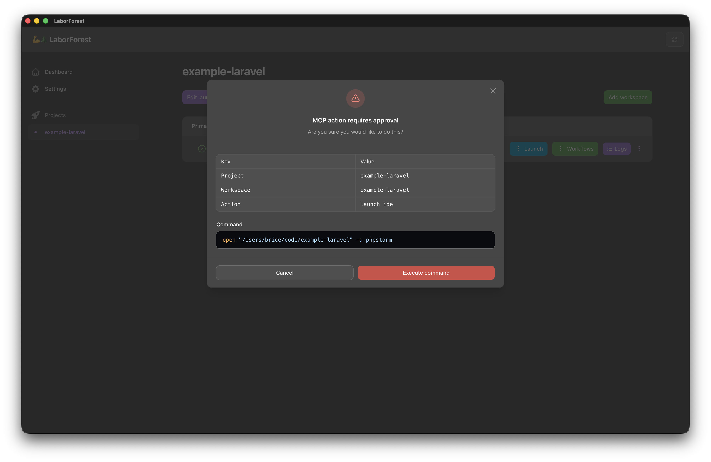

# MCP

## Overview

LaborForest can expose itself to AI agents over the [Model Context Protocol](https://modelcontextprotocol.io). An agent that connects to it can list your Projects and Workspaces, create and remove git worktrees, seed workflows into a Workspace, check those workflow files over without running them, run them, override the status a Workspace holds, delete the run logs they leave behind, open your IDE, terminal or browser against a Workspace, and change both the global settings and a single Project's launch command overrides.

The server is local. It listens on `127.0.0.1` only, it runs as a child process of the app for as long as the app is open, and it is off until you switch it on. When you do, it starts on port `9189` in read-only mode, publishing only the tools that change nothing. The toggle, the read-only switch, the shell command execution policy, the port, the `Add to Claude Code` command, the `Regenerate token` action and the `Test connection` button all live on the [Settings](settings.md) screen.

Turning read-only off gives a connected agent the ability to create and destroy directories on your machine, under your own user account. The four tools that run a command through your shell are gated separately, by the shell command execution policy described below, which keeps them unpublished until you say otherwise. Nothing else asks you to confirm a tool call on the LaborForest side.

## Connecting

The endpoint is `http://127.0.0.1:9189/mcp/laborforest`, over the streamable HTTP transport. The port is whatever the [Settings](settings.md) screen is set to.

For Claude Code, the `Add to Claude Code` field on the Settings screen is the whole registration:

```shell
claude mcp add --transport http laborforest --scope user http://127.0.0.1:9189/mcp/laborforest --header "Authorization: Bearer <token>"
```

Any other client that speaks HTTP MCP connects to the same URL and must present the same bearer token. The token is generated the first time the server starts and lives in `~/.laborforest/settings.yaml`, which is written readable by you alone. Copy the command from the Settings screen rather than retyping it, and treat it as a secret — it carries the token. `Regenerate token` writes a new one and restarts the server; every client registered with the old one has to be added again.

Loopback is not on its own a boundary. Every program running as you can reach the port, and the tools behind it reach your shell, so the token is what actually decides who gets in. Requests are refused for three separate reasons: a missing or wrong token, a `Host` or `Origin` naming anything but the loopback interface — which is how a DNS-rebound request from a web page gives itself away — and more than 120 requests a minute.

The app window is served by its own process, which refuses requests that do not come from the app itself. That guard is swapped out inside the MCP process alone, because no MCP client can satisfy it; what replaces it answers `404` to every path but the MCP endpoint, so the app's own UI is not served on the MCP port.

## Shell command execution

Four tools spawn a command on your machine: `run-workflow` runs the steps of a workflow you wrote, and `launch-terminal`, `launch-ide` and `launch-browser` run the launch commands you configured. The `Shell command execution` setting on the [Settings](settings.md) screen decides what an agent's call to any of them does. It defaults to `Deny`.

| Policy             | What the tool does                     | What the agent is told                        |
|--------------------|----------------------------------------|-----------------------------------------------|
| `Allow`            | Runs the command                       | The run log ID, or `success`                  |
| `Require approval` | Nothing, until you approve it          | `pending manual approval in application UI`   |
| `Deny`             | Nothing — the tool is not published    | That there is no such tool                    |

`Deny` withholds the four tools rather than publishing them and refusing each call, the same way read-only mode withholds the twelve that change something. An agent asking for one is told `Tool [run-workflow] not found.` A tool that could only ever refuse still tells an agent the capability is there and invites it to keep asking; a tool that is absent is understood the first time.

The policy is read on every request, so changing it on the Settings screen takes effect without restarting the server. A client that was already connected may go on showing the tool list it first saw until it reconnects, and a call it makes from that stale list is refused as a missing tool. Under `Allow` and `Require approval` the policy is consulted after the Workspace has been resolved, so a `path` naming nothing still comes back as a missing Workspace.

A settings file that cannot be read is treated as the most restrictive configuration rather than the least: read-only mode and a `Deny` policy are both assumed, leaving `find-project-by-path` and `validate-workflow` as the only published tools. A file the app cannot parse is no evidence of a mode you chose. The shortened tool list that leaves behind cannot be told apart from a deliberately restricted server, so the `settings` resource is not gated the same way — it still answers `Failed to load settings.`, and the `Test connection` button on the [Settings](settings.md) screen still reports the file.

### Approving an action

Under `Require approval`, the tool call itself changes nothing. LaborForest brings its window to the front, on whatever screen you were last on, and shows a modal headed `MCP action requires approval`. The modal names the Project, the Workspace, the action and, for a run, the workflow, and below that shows what would actually run: the workflow file for `run-workflow`, or the launch command for the other three.

What it shows is the command as it will run, not as it was written. Every `{{ }}` tag is resolved first, including `ENV_` values read from that Workspace's own `.env` file, so what you approve is what happens. A tag that cannot be resolved is shown as it was authored rather than hiding the rest of the file.

`Run workflow` or `Execute command` carries the action out, exactly as the equivalent button on the Project screen would. Dismissing the modal does nothing at all: nothing runs, and nothing is recorded. Either way the agent is told nothing further. It was answered when the call was parked, and there is no second message telling it you approved, dismissed, or ignored the request.

Only one parked action is held at a time. A second tool call while a modal is waiting replaces the first, so an approval you have not answered is discarded rather than queued behind the new one.

A parked action carries no reservation. `run-workflow` parks before the Workspace status gate is evaluated, so a run can be parked against a Workspace that would refuse it, and a Workspace's status can change while a modal waits. The gate is enforced when you approve, which is also when a launch command with an unresolvable variable fails. Either failure arrives as a red notification in the app, naming the reason, and nothing is dispatched.

Nothing expires. A modal waits until it is answered or replaced, and quitting LaborForest discards it.



## Use cases

**Start work on a ticket.** The agent calls `add-workspace` with the Project path and a new branch name, `add-workspace-example-workflows` if the Project has no workflows yet, `run-workflow` with your `up` workflow to install dependencies and boot services, then `launch-ide` to put the new Workspace on screen. The agent never needs to know how your worktrees are laid out.

**Clean up when a branch merges.** The agent reads the `workspaces` resource to see which branches still have a Workspace and what state each is in, runs your `down` workflow against the ones that are finished, and calls `remove-project` when a whole repository is no longer wanted.

**Orient itself in a directory it is already sitting in.** An agent working inside a worktree calls `find-project-by-path` with the directory it was started in and gets back a link to the Project resource, which tells it the Project UUID it needs for the rest of the tools.

**Change configuration without leaving the conversation.** `update-settings` writes the global launch commands and the workflow step timeout, and `update-project-launch-commands` writes the overrides that one Project uses in place of them. The `template-variables` resource lists the mustache tags those commands accept.

**Write a workflow it has no tool for.** No tool authors or edits a workflow file — `add-workspace-example-workflows` only copies a fixed starter set into a Workspace that has none. The agent reads the `workflow-schema` resource, writes the YAML with its own file tools, and calls `validate-workflow` to check it. The `author-workflow` and `convert-setup-to-workflow` prompts carry that procedure.

**Reclaim what a busy Workspace has accumulated.** Every run of a workflow, and every child workflow it starts, leaves a log file behind. `purge-workflow-logs` deletes the logs of one workflow in one Workspace, leaving the runs that are still going.

**Pick a failed run back up.** A run that failed leaves the Workspace in `error`, where nothing else will run. The `diagnose-workflow-run` prompt sends the agent to the log files to find out why; it fixes the cause and confirms the fix with `validate-workflow`; then `override-workspace-status` puts the Workspace back to `ready` or `suspended` and `run-workflow` starts the run again.

## Resources

Every resource answers with `application/json`.

| Resource             | URI                                        | Contents                                                                |
|----------------------|--------------------------------------------|-------------------------------------------------------------------------|
| `settings`           | `laborforest://settings`                   | The settings file apart from the bearer token, including `mcp_enabled`, `mcp_read_only`, `mcp_shell_policy` and `mcp_port` |
| `projects`           | `laborforest://projects`                   | Every configured Project, each carrying the `uri` that reads it         |
| `project`            | `laborforest://projects/{uuid}`            | One Project by UUID                                                     |
| `workspaces`         | `laborforest://projects/{uuid}/workspaces` | Every Workspace belonging to one Project                                |
| `template-variables` | `laborforest://template-variables`         | Each variable a command or workflow step accepts, with an example value |
| `workflow-schema`    | `laborforest://workflow-schema`            | The grammar of a workflow file: its keys, the three step types, how a step runs |

A Project carries its `uuid`, `path`, `last_opened` timestamp and any launch command overrides, plus the derived names the variables are built from: `dir_name`, `parent_dir`, `slug_kebab` and `slug_snake`.

A Workspace carries `is_primary`, `path`, `branch`, `status` and `git_status`, plus the same derived names. `status` is the LaborForest Workspace status that decides which workflows may run, and is described in [Workflows](workflows.md).

The `projects` list is ordered by when each Project was last opened. It answers with an empty list rather than an error when no Projects are configured.

`template-variables` lists only the enumerated variables. The `ENV_` prefix, which reads a key out of the Workspace's own `.env` file, is not in that list but works everywhere the enumerated variables do. It is described in [Settings](settings.md).

`workflow-schema` exists because no tool authors a workflow file. An agent asked to write one has to write the YAML itself, and several of the grammar's rules are not guessable from an example: `require_status` and `ending_status` accept only `ready` or `suspended`, a `shell` step's `run` is wrapped in `set -eu; set -o pipefail` while an `if` or `unless` gate is not, a gate's non-zero exit skips the step rather than failing the run while a gate that cannot be run at all fails it, and a step's `name` and the keys of its `env` and `map` are the fields that do *not* expand `{{ }}` variables. The resource is assembled from the same enums the app validates against, so it cannot describe a grammar the app has stopped accepting. The full reference for humans is [Workflows](workflows.md).

## Tools

| Tool                              | Annotation  | Read-only mode | Arguments                                                               | Returns                        |
|-----------------------------------|-------------|----------------|-------------------------------------------------------------------------|--------------------------------|
| `find-project-by-path`            | read-only   | published      | `path`                                                                  | A link to the Project resource |
| `validate-workflow`               | read-only   | published      | `path` to a Workspace, `workflow`                                       | The workflow file it read      |
| `launch-ide`                      |             | withheld\*      | `path` to a Workspace                                                   | `success`, subject to the shell policy |
| `launch-terminal`                 |             | withheld\*      | `path` to a Workspace                                                   | `success`, subject to the shell policy |
| `launch-browser`                  |             | withheld\*      | `path` to a Workspace                                                   | `success`, subject to the shell policy |
| `add-project`                     |             | withheld       | `path`                                                                  | A link to the Project resource |
| `remove-project`                  | destructive | withheld       | `uuid`, `remove_directory`, `remove_worktrees`                          | `success`                      |
| `add-workspace`                   |             | withheld       | `path` or `uuid`, `branch`, `base_branch`                               | `success`                      |
| `add-workspace-example-workflows` |             | withheld       | `path` to a Workspace, `example`                                        | `success`                      |
| `run-workflow`                    | destructive | withheld\*      | `path` to a Workspace, `workflow`                                       | The run log ID, subject to the shell policy |
| `override-workspace-status`       | idempotent  | withheld       | `path` to a Workspace, `status`                                         | `success`                      |
| `update-settings`                 | destructive | withheld       | `dark_mode`, `workflow_step_timeout_seconds`, the three launch commands | `success`                      |
| `update-project-launch-commands`  | destructive | withheld       | `path` or `uuid`, the three launch commands                             | `success`                      |
| `purge-workflow-logs`             | destructive | withheld       | `path` to a Workspace, `workflow`                                       | What it purged and skipped     |

\* The four tools marked with an asterisk are also withheld when the shell command execution policy is `Deny`, whether or not read-only mode is on.

The annotation is what the client is told about the tool before it calls it. A client that asks you to approve destructive tool calls will ask about `run-workflow`, `remove-project`, `update-settings`, `update-project-launch-commands` and `purge-workflow-logs`. The three launch tools carry no annotation: they change nothing in LaborForest, but they do run a command you configured, and calling them read-only would tell a client there is nothing to ask you about. The annotation is the client's own prompt and is separate from the shell command execution policy above, which is LaborForest's. `override-workspace-status` is annotated idempotent rather than destructive, because setting the same status twice leaves the same Workspace and destroys nothing, and an agent recovering a failed run should not have to interrupt you to do it.

`Read-only mode` is which tools the server publishes at all while the read-only switch on the [Settings](settings.md) screen is on, which is where a newly enabled server starts. The four tools that spawn a command have to clear a second gate to be published at all, the policy described in [Shell command execution](#shell-command-execution), so a `Deny` policy leaves ten tools rather than fourteen. A settings file that cannot be read withholds everything both gates cover, leaving the two that change nothing.

### Finding and adding Projects

`find-project-by-path` matches on the exact Project path, with a trailing `/` ignored. It reports `Failed to find project.` when nothing matches, which distinguishes a directory that is not a Project from a projects file that could not be read.

`add-project` takes the path of an existing git repository. The directory has to exist, has to be a repository already, must not be registered as a Project yet, and has to have a clean git status — the same requirements the `Add project` button enforces. The tool creates nothing and commits nothing; a repository with uncommitted changes comes back as `Project with directory '…' has uncommitted changes. Commit or stash them before adding the project.` It returns a link to the new Project resource, so the agent has the UUID immediately.

`remove-project` needs all three arguments. `remove_directory` decides whether the Project's `.laborforest` directory goes with it, and `remove_worktrees` decides whether the worktrees are removed from disk. Passing `false` to both removes the Project from LaborForest and leaves everything on disk untouched.

### Adding Workspaces

`add-workspace` identifies the Project by either `path` or `uuid`, and needs a `branch`. When the branch already exists in the repository, leave `base_branch` out: it is not ignored, and passing it anyway makes the tool try to create a branch that is already there, which git refuses. When the branch does not exist, `base_branch` becomes required and the new branch is created from it. Adding a Workspace fails if the worktree directory it would create already exists.

`add-workspace-example-workflows` seeds one of the starter workflow sets shipped with the app into a Workspace that already exists. `example` must be one of `bare`, `javascript` or `laravel`, and the tool tells the client which names it accepts.

### Running workflows

`run-workflow` takes the Workspace path and the workflow name with no file extension, so `up` runs `.laborforest/workflows/up.yaml`. A name matching no file is reported as `Workflow 'up' does not exist.` before the file is read, so a missing workflow never reads as a parse failure.

The run is queued and the tool returns as soon as it is dispatched, with the run log ID as its result. It does not wait for the workflow to finish and it does not return the step output; the run is watched in the app, on the Workflow log screen. Every step runs — there is no way to run a subset of the steps over MCP, as there is when starting a workflow from the Project screen.

A workflow declaring `require_status` is gated exactly as it is in the app. Asking for one the Workspace is not in a position to run is refused with a message naming both statuses, for example `Workflow [up] requires the workspace to be suspended, but it is ready.` See [Workflows](workflows.md) for the statuses and the gate.

Under the `Require approval` shell policy none of that happens on the call. The name is still checked against the file, so a workflow that does not exist is still reported immediately, but the status gate is not evaluated until you approve, and the reply is `pending manual approval in application UI` rather than a run log ID. Under `Deny` there is no `run-workflow` tool to call.

Steps run with the workflow step timeout from the settings file, and with LaborForest's own environment stripped out, so a workflow does not inherit the app's configuration.

### Validating workflows

`validate-workflow` answers the question `run-workflow` cannot be asked without consequences: is this workflow file usable? It takes the same Workspace path and workflow name, reads the file, and returns without starting anything.

It reports on the file alone. A name matching no file is `Workflow 'up' does not exist.`, the same message `run-workflow` gives. A file that does not parse, or that parses into something the workflow rules reject, comes back as the whole list of problems at once — `The workflow file [...] is invalid: The steps field is required. The selected ending status is invalid.` — rather than one problem per call. Those rules cover the shape of every step and reject a mustache tag naming a variable LaborForest does not recognize, wherever it appears: `run`, `if`, `unless`, an `env` value or an `update_env` value.

What it deliberately does not do is inspect the Workspace. Whether an `ENV_` passthrough resolves against that Workspace's `.env` right now, and whether the Workspace holds the status a workflow declaring `require_status` needs, are facts about this moment rather than about the file — so a workflow that validates does so identically in every Workspace, and only `run-workflow` enforces the gate.

A workflow that passes comes back as what was read: the workflow name, the file path, its `require_status` and `ending_status`, and the name and type of each step in order.

### Purging run logs

`purge-workflow-logs` takes the Workspace path and a workflow name, and deletes the run logs that workflow has written in that Workspace. It matches on the workflow name recorded inside each log rather than on the file name, and it never touches another workflow's logs or another Workspace's.

Runs that are still pending or running are counted and left on disk, because the job holding one is still writing to it. The result says so: `Purged 4 log records. Skipped 1 still in progress.`, or `Purged 4 log records.` when nothing was skipped.

A name matching no log is `Purged 0 log records.` rather than an error, so calling it twice is safe. Unlike `run-workflow`, the tool does not check that the workflow file still exists — logs outlive the workflow that wrote them, which is exactly when purging them is worth doing.

### Overriding a Workspace status

`override-workspace-status` takes the Workspace path and the `status` to give it, and accepts `ready` or `suspended` — the same two the `Override status` action on the Project screen offers, and the same two a workflow file may name. It is the MCP equivalent of that action.

It exists for the one status a workflow can leave behind but never clear. A failed run ends in `error`, a Workspace in `error` runs nothing, and until this tool the only way out of it was the app. An agent that has diagnosed the failure and fixed the workflow can now clear the status and run again in the same turn.

A Workspace whose run is still in flight — `pending` or `working` — is refused, with a message naming the status it holds: `Workspace at path '/tmp/repo-feature' has a workflow run in flight and is 'working'. Override the status from the app once the run has finished.` The job that is running writes its own final status when it ends, so an override applied now would be overwritten moments later; worse, a Workspace forced to `ready` mid-run would accept a second `run-workflow` against the same worktree. The app's own override carries no such guard, and stays the way out when a job has died without writing its status back.

The statuses themselves, and the gate they feed, are in [Workflows](workflows.md).

### Changing settings

Every argument to `update-settings` is optional, and one that is omitted or `null` leaves the stored value alone. Passing an **empty string** to a launch command clears it instead, which is how a command is removed rather than replaced. The same three values are the rule for `update-project-launch-commands` below.

A launch command is validated the same way the Settings form validates it: a mustache tag naming a variable LaborForest does not recognize is rejected, with the unknown names listed.

`update-settings` cannot change `mcp_enabled`, `mcp_port`, `mcp_read_only` or `mcp_shell_policy`. The server has no way to switch itself off or move itself, which would disconnect the client that asked, and no way to publish more tools for itself or to lift its own shell gate. All four are changed on the [Settings](settings.md) screen.

### Changing a Project's launch commands

A Project may override any of the three launch commands, and `update-project-launch-commands` writes those overrides. It identifies the Project by either `path` or `uuid`, the same way `add-workspace` does, and is the MCP equivalent of the `Edit launch commands` button on the Project screen.

The three values behave as they do for `update-settings`: omitted or `null` keeps what is stored, a string sets it, and an empty string clears the override so the Project falls back to the global command again. A cleared override is stored as nothing at all rather than as a blank command, which would otherwise leave that Project launching nothing.

Which command actually runs is described in [Projects and Workspaces](projects-and-workspaces.md): the Project's override when it has one, the global command otherwise.

## Prompts

A prompt is a template your MCP client offers you by name — usually as a slash command — that expands into instructions for the agent. Invoking one runs nothing and changes nothing on your machine; it only tells the agent what to do next, so every effect still arrives through a tool call or through the agent's own file tools.

The three prompts cover the jobs that take more than a tool call, all of them to do with the workflow files no tool authors.

| Prompt                      | Arguments                        | What it does                                                                   |
|-----------------------------|----------------------------------|--------------------------------------------------------------------------------|
| `author-workflow`           | `path`, `goal`, optional `name`  | Writes one new workflow for a Workspace from a description of what it should do |
| `convert-setup-to-workflow` | `path`, optional `source`        | Turns a project's existing setup instructions into the workflows that reproduce them |
| `diagnose-workflow-run`     | `path`, optional `workflow`      | Works out why a run failed, by reading the run logs on disk                      |

### Authoring a workflow

`author-workflow` takes the Workspace path and a description of what the workflow should do, and optionally the name to give it. It points the agent at the `workflow-schema` and `template-variables` resources, has it read the Workspace's existing workflows and the repository itself before choosing any commands, writes the file, and then checks it with `validate-workflow` until it passes.

The instructions it carries are as much about restraint as about grammar. Every step should be safe to run twice, so a step that creates something is gated with `unless` and one that removes something with `if`. Anything specific to a single Workspace — a database name, a URL, a bucket — belongs in an `update_env` step built from mustache tags rather than hard-coded into a command. And the agent is told not to run the workflow to test it: `validate-workflow` is the check, and starting a run is your decision, not the agent's.

`convert-setup-to-workflow` is the same job starting from what a project already documents — a README section, a Makefile, the scripts of a package manifest, a compose file — and it additionally has to split those steps into an `up`, a `down` and whatever operational workflows the project needs, by what each step does to the Workspace rather than by which file it came from. It reports what it could not convert, which is usually an interactive step that has no non-interactive equivalent.

### Diagnosing a failed run

Nothing on this server reports on a run. `run-workflow` returns a run log ID and returns immediately, and there is no tool that reads a log back. `diagnose-workflow-run` closes that gap by sending the agent to the files themselves, in `.laborforest/ignored/logs/` inside the Workspace.

It explains what to read: the log file names sort by time, so the newest run is the last one; the failing step is the one with a non-zero `exitCode`, while the steps after it carry `skip_reason: aborted` and never ran at all; the `output` is raw stdout and stderr with ANSI escapes still in it; and a failing `workflow` step's `log_id` names the child run's own log, which is where the real failure is.

It ends by handing back to you, but only for the decision. A failed run leaves the Workspace in `error`, and the prompt has the agent clear it with `override-workspace-status` once the cause is fixed and `validate-workflow` passes — then stop, because whether to start another run is yours to say.

## Errors

A tool that fails returns the underlying message as an MCP error rather than raising anything, so the failure arrives as readable text in the agent's transcript: `Workspace at path '/tmp/nope' not found.`, `Project with UUID '…' not found.`, `The projects file [.laborforest/projects.yaml] is invalid: …`. An agent can usually act on these without your help.

A tool that is missing rather than failing is the other case an agent cannot act on. Read-only mode and a `Deny` shell policy both withhold tools instead of publishing ones that refuse, so the failure reads as `Tool [run-workflow] not found.` Nothing the agent can do will change that answer; which tools are published is yours to decide on the [Settings](settings.md) screen.

A failure that happens after you approve a parked action has no route back to the agent, which was answered when the action was parked. It arrives as a red notification in the LaborForest window instead.

Failures to connect at all are a different matter, because most clients report a missing server, a wrong port and a refused request identically. The `Test connection` button on the [Settings](settings.md) screen tells the cases apart.

## Constraints

The server binds to `127.0.0.1` and cannot be moved to another interface. There is no configuration for exposing it on a network, and the endpoint is plain HTTP, which is correct for a loopback address.

Authentication is a single bearer token, shared by every client. There are no per-client tokens and no scopes. There are two gates, and both are all-or-nothing: read-only mode decides which tools are published at all, and the shell command execution policy decides whether the four that spawn a command are published and what they then do. Neither can be narrowed to one Project, one Workspace or one workflow. A client that was connected when you change either one may keep showing the tool list it first saw until it reconnects.

Read-only mode counts `launch-ide`, `launch-terminal` and `launch-browser` as changes, because they run a command you configured, even though nothing inside LaborForest moves.

The server runs only while the app does. Disabling MCP stops the process outright, and a client then finds nothing listening rather than a server that answers with fewer tools. Changing the port stops the process and starts a new one on the new port.

The port has to be between `1024` and `49151`, and it cannot be the port the app window is served on.

The server exposes no interactive MCP apps, only the tools, resources and prompts above. It reports the app's own version to clients, and is not versioned separately.

Everything a tool does runs as the logged-in user, on the same machine, with that user's git credentials and shell.

---

| Previous                  | Next |
|---------------------------|------|
| [CLI tools](cli-tools.md) |      |
