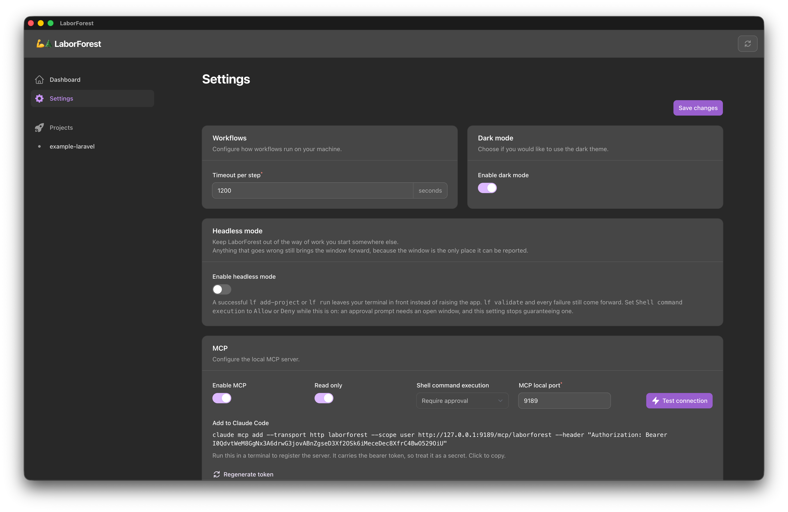

# Settings

## Overview

Settings is where you configure global settings for LaborForest. You can navigate to it at any time using the menu on the left. Changes take effect when you click `Save changes`.

## Workflow step timeout

The timeout is specified in seconds and defaults to `600` (10 minutes). The form accepts any whole number from `0` to `3600`. Setting it to `0` disables the timeout entirely, and workflow steps run for as long as they need.

The timeout applies to each process a workflow spawns, not to the workflow run as a whole. Every `shell` step's `run` command gets the full budget, and so does every `if` and `unless` condition. A workflow with ten steps and a 600 second timeout can therefore run for much longer than 600 seconds.

When a step exceeds the timeout, the step is killed, the workflow run is marked as failed, the remaining steps are marked as aborted, and the Workspace status becomes `error`. The killed step is recorded as failed with a `failure_reason` naming the timeout, so it is distinguishable in the run log from the aborted steps behind it. A timed-out `if` or `unless` condition fails the step it was guarding the same way, even though a condition's exit code on its own never fails a run.

## Dark mode

Dark mode is controlled by a toggle switch and is enabled by default. This toggle is the only theme control in the app.

## MCP

LaborForest can expose itself to AI agents over the [Model Context Protocol](https://modelcontextprotocol.io). The server is local: it listens on `127.0.0.1` only, and it runs for as long as the app does. This section covers the settings; the tools and resources the server exposes, and what an agent can do with them, are covered in [MCP](mcp.md).

`Enable MCP` starts and stops the server, and is off by default, so an agent reaches nothing until you decide otherwise. `Read only` limits the server to the tools that change nothing, and is on by default, so a newly enabled server can look but not touch. `MCP local port` sets the port it listens on, accepting any whole number from `1024` to `49151` and defaulting to `9189`. Saving a changed port stops the running server and starts a new one on the new port.

### Shell command execution

`Shell command execution` decides what happens when an agent calls one of the four tools that spawn a command on your machine: `run-workflow`, `launch-terminal`, `launch-ide` and `launch-browser`. It defaults to `Deny`, so the first thing you do after turning read-only off is decide this.

| Setting            | What an agent's call does                                                                          |
|--------------------|----------------------------------------------------------------------------------------------------|
| `Allow`            | Runs immediately, with no prompt.                                                                    |
| `Require approval` | Changes nothing. LaborForest comes to the front and shows you what would run, and you decide.         |
| `Deny`             | Nothing to call: the four tools are not published, and the agent is told no such tool exists.         |

`Deny` withholds the four tools rather than publishing ones that refuse, the same way `Read only` withholds every tool that changes something. Saving a change to this setting therefore changes which tools the server publishes — a client that is already connected may need to reconnect to see the new list.

The field is disabled while `Enable MCP` is off, and while `Read only` is on, because read-only mode already withholds all four tools. Both toggles take effect in the form as you click them, before you save. The setting is stored as `mcp_shell_policy` in `~/.laborforest/settings.yaml`, and the server cannot change it: `update-settings` does not accept it, so an agent cannot loosen its own gate.

A settings file LaborForest cannot read is treated as `Read only` with a `Deny` policy, so a broken file leaves the server publishing only the two tools that change nothing rather than every tool it has.

`Require approval` puts the decision in front of you rather than in front of the agent. What the approval modal shows, what happens when you dismiss it, and what the agent is told meanwhile are covered in [MCP](mcp.md).

With MCP enabled, the section shows one read-only field, `Add to Claude Code`: the one-line `claude mcp add` command that registers the server's endpoint, for example `http://127.0.0.1:9189/mcp/laborforest`. It copies to the clipboard when clicked, and it tracks the port field as you type it, before you save.

The command carries the bearer token the server requires, so treat it as a secret rather than something to paste into a ticket. The token is generated the first time the server starts and stored in `~/.laborforest/settings.yaml`, which is written readable by you alone. `Regenerate token` replaces it and restarts the server; any client registered with the previous token stops working until it is added again with the new command.

The endpoint is plain HTTP, which is correct for a loopback address. Clients do not require TLS to connect to `127.0.0.1`, and a self-signed certificate would be rejected by clients that run on Node.

### Test connection

The `Test connection` button beside the `MCP local port` field completes a real MCP handshake against the port currently in the form and reports what it found. It exists because a client cannot tell these cases apart: most MCP clients report every one of them as either a missing server or a request to sign in.

| Result | What it means |
|--------|---------------|
| The MCP server answered | The endpoint completed a handshake. The notification names the server, its version, and the protocol version. |
| Nothing is listening | Nothing accepted the connection. The server is switched off, or it is running on a different port. |
| The endpoint refused the request | The endpoint answered `401` or `403`. The bearer token was rejected, another application owns that port, or the app's own browser guard is still in front of the route. A client reports this as a request to authenticate. |
| Something else is on that port | The endpoint answered, but not with an MCP handshake. Another application is using the port. |
| The endpoint answered with an error | The endpoint answered with some other error status. |
| That port belongs to the app window | The port names the server that renders LaborForest itself. Pick another port. |

The check presents the saved bearer token, so a correctly configured server answers rather than challenging it. It sends nothing else, because the app's own browser guard is one of the cases the check exists to name.

The check uses the port shown in the form rather than the saved one, so testing a port you have typed but not yet saved reports what a client would find right now, which is usually nothing.

## Launch commands

Launch commands let you open an application against a specific Workspace's directory or local site. The commands shown on the Settings page are the defaults LaborForest ships with, not placeholders. Each field has a `Show example` button that fills the field with a working example.

Every command can be overridden per `Project` from the Project screen. Project-level overrides are stored in `~/.laborforest/projects.yaml`, not in the project's own `.laborforest` directory.

Leaving a command empty at both the global and project level means the corresponding entry does not appear in the Workspace `Launch` menu.

### Launch terminal command

The command to run when launching a terminal for the current Workspace. The shipped default opens the Workspace directory in `iTerm2`.

### Launch IDE command

The command to run to launch your IDE of choice, opening the current Workspace. The shipped default opens the Workspace directory in `PhpStorm`.

### Launch browser command

The command to run to launch a web browser with the current Workspace's local site URL. This is only applicable to web projects. The shipped default reads `APP_URL` from the Workspace's environment file, which suits Laravel projects.

### Available variables

Each command supports a number of variables that can be injected using mustache tags, for example `{{ VARIABLE }}`. Whitespace inside the tag is ignored, so `{{WORKSPACE_DIR}}` and `{{ WORKSPACE_DIR }}` are equivalent. Example values for each variable are shown in the table.

| Variable                     | Example                                |
|------------------------------|----------------------------------------|
| `{{ PROJECT_PRIMARY_DIR }}`  | `~/code/project-name`                  |
| `{{ PROJECT_SLUG_KEBAB }}`   | `project-name`                         |
| `{{ PROJECT_SLUG_SNAKE }}`   | `project_name`                         |
| `{{ WORKSPACE_DIR }}`        | `~/code/project-name-branch-name`      |
| `{{ WORKSPACE_SLUG_KEBAB }}` | `project-name-branch-name`             |
| `{{ WORKSPACE_SLUG_SNAKE }}` | `project_name_branch_name`             |
| `{{ ENV_ANY_KEY }}`          | any key from `.env` prefixed by `ENV_` |

A command containing a variable LaborForest does not recognize is rejected when you save, with the unknown names listed in the validation message. The same variables are available in workflow steps, which is covered in [Workflows](workflows.md).

#### Environment file variables

Variables prefixed with `ENV_` are special and denote loading a value from the Workspace's `.env` file, so `{{ ENV_FOO_BAR }}` loads the value stored under the key `FOO_BAR`. The file is read from the Workspace directory, not from the project's primary directory, so each Workspace resolves its own values.

The key must be uppercase and may contain digits and underscores after the first character. A key that is well formed but missing from the Workspace's `.env` file is not caught when you save. It fails when the command runs, with an error naming the key and the file it looked in.

---

| Previous                  | Next                                                |
|---------------------------|-----------------------------------------------------|
| [Dashboard](dashboard.md) | [Projects & Workspaces](projects-and-workspaces.md) |
